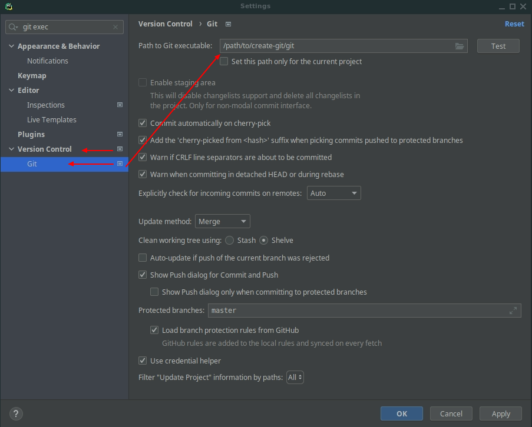

# Create Git - Executable file with SSH Key
This project contains tool to generate binary executable git file which using your SSH private key in passed path.
This is wrapper for git command.

## Why and When ?
- When You are working on private machine (Notebook, Desktop) and You would like to separate your
  private configuration (private OpenSource projects) and your company configuration.
- When Your company has implemented not-standard authentication methods (i.e., Username & Password) by HTTPS
  (i.e., by Token in GitLab self-hosted)
- When Your favourite IDE does not support and store path to SSH Key for Git (i.e., PyCharm 2021.1.2)
- When You don't run ssh-agent in daemon mode using only in your company (and adding SSH Key to each session in shell)
- When You don't want to configure in global home directory ssh-keys used by Your company [Security Reason]

## Requirements
- ssh 
- ssh-agent
- ssh-add
- bash
- git
- shc           #   compile sh scripts to binary executable

## Installation

### [How to install required SHC](doc/install.md)

### Create-Git

Download or clone this repository:

    git clone https://github.com/Webinterpret/create-git.git
Change directory:

    cd create-git

Check files:

    ls -la

Compare if structure is like below:

    ├── create-git              # The main git executable creator (compiled from ./src/create-git.sh)
    ├── README.md               # This README.md file
    └── src                     # Source directory
        ├── create-git.sh       # Main git executable creator source code written in bash
        └── git.sh              # Main source code of git wrapper command used to compile locally written in bash 

## Usage (after `cd` to `create-git` directory)

To see available options:

    $ ./create-git -h
or

    $ ./create-git --help

or 

    $ ./create-git -?

Example:

    $ ./create-git -k /path/to/your/company/topsecret/private/key [-s|--source] [i.e. /home/{user}/repositories/create-git/src] [-t|--target] [i.e. /top/secret/path/to/encrypted/company/drive/bin/]

## Compiling `create-git.sh` script

When you change `/src/create-git.sh` file then you need to compile new version like below (when you inside main project dir):

    $ shc -f src/create-git.sh -o create-git && rm src/create-git.sh.x.c

After that you can commit new version for create-git tool.

## Use cases

When you want to change system git executable in PyCharm:

1. Open `Settings`
2. Find `Version Control` section
3. Find `Git` section
4. Find `Git executable` and fill like below:

